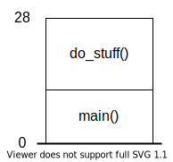

# What are pointers?

Pointers are notorious for being confusing. What do they really do?

The reason most people find pointers confusing is that few people have a
rigorous understanding of how a program is represented in memory. This is
unsurprising, since few languages or applications of programming explicitly
demand such an understanding, but pointers are one of the times where this
understanding is required.

Never fear, memory is not nearly as confusing as it might sound.
Memory in computers is simply an enormous array (list) of numbers. In modern
computers, each number in this giant array is 1 byte, which represents an
8-digit binary number. The only thing necessary to know about bytes is that
memory is just a huge array of bytes, with one in each "slot." We say that a
byte is the "smallest addressable piece of data" in a computer, that is, memory
is labeled per-byte, and you cannot request a piece of data smaller. You can go
to memory and say "I want the 17th thing in memory," but you cannot ask the
computer for the "17.6th thing in memory" and extract data in smaller
increments; the smallest thing you can address is 1 byte.

Let's say we are writing a C program, and we want to add 3 numbers together.
Our program will look something like this:

```c
int main()
{
    int a = 3;
    int b = 5;
    int c = 0;

    c = a + b;
    
    // ...
```

and then presumably we would print out `c` or otherwise use it for something.

When we compile and run our program, the values of `a`, `b`, and `c` need to
be kept track of somewhere, and that somewhere is in memory.
Here is what memory looks like when our program executes:


At first, we have simply initialized our values, and then we perform an addition
to change the value of `c`.

The "offset" values are the same addresses we discussed earlier; most data types
used in programs, such as `int` and `float` take up 4 bytes. In these cases, we
refer to each variable by the address of its first byte. For instance, `a` is
stored in the 4 bytes which start at location 0, `b` is stored in the 4 bytes
which start at location 4, `c` is stored in the 4 bytes which start at location
8, and so on. The size of each variable is determined by its datatype; the
compiler sees `int a` and sets aside 4 bytes for `a`, since an `int` is 4 bytes
large.

Guess what: we've just described all of these variables using pointers. Pointers
are nothing more than a "handle" on data, which refer to the data based on where
it is located in memory, rather than with a name like `a`.

We could add a pointer to our program:

```c
int main()
{
    int a = 2;
    int b = 5;
    int c = 0;
    int* p = &c;

    c = a + b;
    
    // ...
```

We have created `int* p`, a pointer named `p` which refers to an `int`. We also
immediately gave it a value: the address of c, `&c` (`&` means "the address of").
We of course already know what the address of `c` is from last time, it is `8`.
So the pointer `int* p = &c` will contain the value `8`. Here's what our memory
looks like now:


We see that `p`, far from being something strange, is simply an integer. The
only strange thing about it is that it stores the address of another piece of
data in our program. By dereferencing `p`, we fetch the data stored at the
address stored in `p`, in this case jumping to address `8` to retreive the
contents of `c`, `7`.

The strange idea of "dereferencing" pointers may seem somewhat more concrete
now; pointers "refer" to data via an address, so "dereferencing" the pointer
literally means skipping the indirectness and retrieving the data being
referred to. If we dereference our pointer by writing `*p`, we will simply
retrieve whatever value is currently stored in `c`. In the diagram above,
which was the state of the program before the addition happens, that value is
zero. However, the thing about pointers that is so powerful is that after
the addition happens, if we then dereference `p` again with `*p`, the value we
obtain is the new value of `c`, in this case `7`! Since we are referring to
the location of `c`, we can peek at whatever value `c` has whenever we like,
and will always see the most updated value.

In isolation, this is a fairly boring example, which doesn't have much apparent
use, so let's look at some more powerful applications. 

Before we move on,
however, it's important to know how the computer knows to read 4 bytes at the
location referred to by the pointer: it knows based on the datatype of the
pointer. Just like `int a` tells the computer to keep track of a 4-byte chunk
of memory called `a`, `int* p` tells the computer to keep track of an address
which points to an `int`, which is 4 bytes. Dereferencing `p` is saying "go
fetch the 4-byte `int` at the location you're storing." We could have made a
pointer of type `char*`, which would refer to the 1-byte chunk of memory
located at the stored address (the `char` datatype is fundamentally just a
1-byte integer).

## Dynamic memory

We can now figure out why pointers are necessary for dynamic memory management.

Let's imagine a new program, which contains a piece of dynamic memory allocated
at runtime by calling `malloc()`:

```c
int main()
{
    int* p = malloc(sizeof(int));
    
    // ...
}
```

We created a pointer, `int* p` as before, but this time, instead of the address
of an existing value, we have assigned it to the return value of `malloc()`.
`malloc()` creates a chunk of memory somewhere with the specified size (the size
of an `int`, 4 bytes, in this case), and returns the location where it was
created. This scenario isn't all that different from before; it's a pointer
referring to an `int` somewhere in memory. There's one key difference, though:
the `int` in this case has no name! It was created on the "heap" (a section of
memory which holds dynamic data) during program execution, and does not have a
convenient name like `a`, `b`, or `c` did. This is powerful, allowing data to
transcend the logical structure of the program, but also risky: if you assign
the pointer to something else without first calling `free()` on it to delete the
`malloc()`d data, that data will be lost! It will still persist in memory, with
no handle to grasp it with, and will remain until the program exits. This is
what a "memory leak" is.

Here is an example of a memory leak:

```c
int main()
{
    int* p = malloc(sizeof(int));
    int c = 3;

    p = &c;  // leak!

    // ...
}
```

and the resulting memory:


We can see that the `malloc()`'d data still exists in the heap, but since we
reassigned our pointer to the address of `c`, we no longer are able to find it!
To prevent this, we can simply call `free()` on the pointer to free the memory
we `malloc()`'d:

```c
int main()
{
    int* p = malloc(sizeof(int));
    int c = 3;

    free(p);
    p = &c;

    // ...
}
```

Calling `free()` on a pointer which points to dynamic data (any data created
using `malloc()`) frees the memory from use, allowing that region of memory to
be repurposed for other things. Data on the stack (i.e. "regular" variables like
`c` in our example) don't need to be freed manually, because the function which
contains the variable is handled in a predictable way in memory (discussed later
in "[the stack](#the-stack)") and can be freed automatically.

The utility of a single, dynamically allocated `int` is not apparent, since such
an object can simply be passed by value with minimal overhead, but this concept
is a precursor to one of the most useful tools in all of programming: dynamic
arrays. All data which goes on the "stack" (another region of memory like the
"heap"; all of our normal variables, and anything else that isn't created with
`malloc()` goes here) has a requirement imposed on it: the size of the data must
be known at compile-time. The computer must know that an `int` is 4 bytes. The
same goes for arrays: if we wish to create an array on the stack, we simply
declare it with

```c
int my_array[10];
```

and we have an array of 10 integers, named `my_array`. But what if we want to
create an array at runtime, depending on, say, user input?

```c
int user_input = 5;  // pretend this came from the user
int my_array[user_input];   // compiler error!
```

This is not allowed, because the executable cannot possibly know how much
memory to set aside to store `my_array` before the fact (this detail must be
hard-coded into the executable upon compilation). The answer to this is
dynamic arrays. Instead, we will create our array on the heap, and refer
to it with a pointer:

```c
int user_input = 5;
int* my_array = malloc(user_input * sizeof(int));
``` 

This works just fine! We have created an array by allocating 20 bytes (5 times
4 bytes per `int`), and giving the address of the start of this region to the
pointer. We access elements of this array the same way we usually index arrays:
square brackets. It becomes clearer in this case, though, that square brackets
are a syntactic shortcut for something a little more complex. When we allocate
*n* bytes of memory using `malloc(n)`, we create a chunk of *n* contiguous bytes
in memory. There is no explicit structure in this arrangement, so where does the
indexable array behavior come from? It turns out, when we index an array with
square brackets like `my_array[4]`, this actually means `*(my_array + 4)`.

Several things are happening: first, we are "adding" 4 to our pointer. Pointer
arithmetic is an entire subject to explore separately, but suffice it to say
that when you add a number to a pointer, e.g. `ptr + 2`, the pointer interprets
this as `ptr + 2*sizeof(type)`, where `type` is the type of the pointer, say,
`int`. This means that when you add 2 to the pointer, you are not actually
adding two to its address, but rather adding 2 "`int`-sized jumps" to the
address. This is convenient because when it comes to arrays, if we want to find
the address of the *n*th element of the array, we can find it via

```c
int* elem = my_array + n;
```

This same mechanism is behind array accesses: when we write `(my_array + 4)`,
we are finding the address of the 4th element of `my_array`. Dereferencing this
value with `*(my_array + 4)` simply returns the data itself at that address, so
we now see how this syntax is equivalent to `my_array[4]`. The latter syntax is
much cleaner, but understanding the underlying mechanism allows you to be
confident about what is happening when extending this behavior to dynamic
arrays, which seemingly consist of a structureless chunk of memory, yet exhibit
the same familiar array structure. Indeed, all arrays actually function this
way, but the abstraction created by the square brackets syntax does an excellent
job of concealing this for the case of arrays allocated on the stack.

## Double pointers

Double pointers are most people's worst enemy when writing C, but there is
really no reason to find them confusing: they just add a second level of
indirection on top of what we've already seen. This is best shown by example:

Imaging we have an array, called `char* my_str`, which stores some number of
characters. It turns out that the convenient "strings" most programming
languages have handed you are nothing but pointers to arrays of ASCII characters
(`char`), which are each one byte. If this is in any way confusing, remember
that `char`s are nothing but 1-byte integers. They only behave like characters
because we decided to treat them that way by calling them `char` and telling
certain functions (like `printf()`) how to interpret them as characters
([here](http://www.asciitable.com/) is an ASCII table, take a look to see what
the exact conversion is from 1-byte integers to characters).

We can initialize a string explicitly as a list of characters:

```c
char my_str[] = {'H', 'e', 'l', 'l', 'o', ' ', 'W', 'o', 'r', 'l', 'd', '!', '\0'};
```

Note the very end: we include `'\0'`, the "null character" (which has a
numerical value of `0`), in our string. This serves as a convenient flag to
indicate that the string has ended; otherwise, a program would have no idea when
the string had ended without also having an explicit length of the string as
well. We say that strings are **null terminated**, and the utility of this will
be seen shortly.

We can also initialize a string with a "string literal" using double quotes:

```c
char my_str[] = "Hello world!";
```

This is identical to the syntax above, and also automatically inserts the null
terminator without us having to explicitly insert it. How convenient!

We can treat `char`s as either ints or characters; the following statements are
completely equivalent:

```c
char my_char = 78;
char my_char = 'N';
```

`'N'`, with single quotes, is a "character literal" which just exists to make it
more convenient to assign the values of `char`s that are actually being used to
store ASCII text. Under the hood, the compiler uses the ASCII table to directly
translate `'N'` into the number `78`, so the statements above are exactly the
same.

That means we could even have defined our string as follows:

```c
char my_str[] = {72, 101, 108, 108, 111, 32, 87, 111, 114, 108, 100, 33, 0};
```

which should make you rather appreciative of the utility of string and character
literals.

This is all sort of an aside, but when dealing with raw bytes of data, `char`
is an important datatype to be very familiar with since it is often used to
store a generic byte from memory, and has nothing to do with ASCII text.
Sometimes, the `<stdint.h>` header will be used instead, allowing for the use of
`uint8_t`, a 1-byte unsigned integer type which represents one byte of generic
data. Using this datatype makes the code easier to read, since using `char` may
confuse people into thinking that the program is operating on text when it
really isn't. Underneath, though, it is the exact same thing; the definition of
`uint8_t` is simply `typedef unsigned char  uint8_t;`, so understanding `char`
leads to a generic understanding of how binary data is handled.

Now, back to double pointers.

Let's say for the sake of example, we want to make a function which finds the
first occurence of a character in a string. We could simply make our function
return the address of the character, and our function would look
like this:

```c
/* find_char  --  given a string and character to find, finds the first
   instance of the given character and returns its address. */
char* find_char(const char *str, char search_tgt)
{
    char* itr = str;  // set our iterator to point to the start of the string

    /* As long as we haven't hit the end of the string (that is, as long as the
       character under the iterator is not '\0'), perform the following loop: */
    while (*itr != '\0')
    {
        if (*itr == search_tgt)  // If the character we're looking for is found,
        {
            return itr;          // return its address.
        }
        itr++;  // If not, advance the iterator to the next char in the string
    }

    return NULL;  // If we make it through the whole string without finding
                  // our desired character, return NULL.
}
```

Our function will step through the string as long as it doesn't hit the null
character, and if the character under the iterator is the target, return its
address; otherwise, return `NULL` if the character wasn't found.

This is all well and good, but let's impose an additional requirement on our
function: we want it to be reentrant, that is, we want to be able to call the
function a second time and have it pick up where it left off. Since we would
prefer to avoid the mess of having some sort of internal variable to save the
last position, we can instead save the location of the last visited character
with a pointer.

There an issue, though. Let's say we pass our "bookmark" pointer to the function
with an argument `char* left_off` like so:

```c
char* find_char(const char *str, char search_tgt, char* left_off);
```

That's how you pass the location of data to a function, right? We frequently
pass things to functions with pointers like this, but this situation is
different. Let's say that we set up our function call like so:

```c
int main()
{
    const char my_str[] = "Hello world!";
    char* bookmark = NULL;

    char* found = find_char(my_str, 'o', bookmark);

    // ...
}
```

**This will not work!**

Without even looking at the contents of the new function, we can discover why.
This is an opportune time to talk about the stack.

### The Stack

Since a program can only execute one line of code at a time, calling functions
can be organized in the following way: consider the program

```c
int main()
{
    int a = 3;
    int b = 5;

    int c = do_stuff(a, b);
    
    return 0;
}
```

`main()` contains several local variables, `a`, `c`, and `b`. These variables
essentially constitute `main()`'s "scratchpad" which is what the programmer uses
to organize the data needed by the program to do its job. This scratchpad, which
we call "local memory" (as in, local to the function) needs to live somewhere in
memory, so that we can keep track of this data.

`do_stuff()`, whatever it may do, also likely contains some local variables as
a scratchpad to facilitate whatever stuff it does. These variables naturally
must also live somewhere in memory for us to keep track of and access them.

The way computers often organize this information is called "the stack." A stack
is a type of data structure which operates like a stack of dishes: you can pile
things on top of the stack, and take them off of the stack, but you can only add
or remove data from the top. This structure is very simple because, by requiring
each element of the stack to keep track of the location of the element below it,
we can keep track of the whole stack by storing only the address of its top,
which is our point of access to the structure.


In the case of an executing program, the stack elements are the "frames" which
store the local data of each function in the "call stack." You may have seen a
stack in a **stack trace**, which typically looks something like this:

```
Something bad happened: your program has crashed, silly you.
    #0 in some_other_func() at other_stuff.c:<line number>
    #1 in do_stuff() at do_stuff.c:341
    #2 in main() at main.c:6
```

this structure is a handy description of the stack at the time of the crash,
and what it's describing is this:

When we begin our program, the function `main()` is automatically called
(`main()` is the entry point of the program). `main()` needs a chunk of memory
to perform its local operations. The compiler inspects the code upon compilation
and determines that `main()` will need a stack frame of 12 bytes, 4 for each of
the 3 local `int`s it uses. At the beginning of the program, our stack looks
like this:


Note that although these diagrams are schematic, they are actually fairly
representative of what happens in memory. There really is a location in address
space that contains a contiguous chain of stack frames to faciliate this
structure. The reason why this is such an effective method is that when we
compile our program, the compiler can be absolutely certain about how much
memory each function call will take by inspecting its local data, so we can
use this fast and compact system to store their data. This is not the case with
dynamic data which we get from `malloc()`, the size of which is not known when
the program is compiled.

Now we reach line 6 of our program above, and `main()` calls `do_stuff()`. Let's
say that `do_stuff()` requires 16 bytes for its local data, so we create a
16-byte frame on top of `main()`'s frame, which allows `do_stuff()` to operate
on its local data as necessary, without interfering with `main()`'s data.



Following our fake stack trace example, let's say `do_stuff()` calls another
function, `some_other_func()`. Let's pretend this function needs 8 bytes of
memory to do its work, so we just continue adding stack frames for each of our
functions. When our program crashes and generates the stack trace above, this
is what the stack trace looks like:


Glancing back to our fake stack trace, we can see that the trace was actually
just a list of all the frames on the stack. #0 represents the topmost (most
recent) call, #1 represents the frame of the calling function, #2 represents
the frame of the function that called #1, and so on.

The ability to analyze the contents of the stack is incredibly useful, because
it helps you track down the source of the crash. Often times, the topmost few
frames in the stack belong to library functions which you didn't write; the
program probably crashed because you fed them bad data! Luckily, by inspecting
the stack, you can follow the chain of calls that led the program to that point,
and by observing the data in the frames, you can see what conditions led to the
crash.

If our program hadn't crashed, at some point `some_other_func()` would finish.
Since it's done, we no longer need its local data, so we simply discard ("pop")
its frame from the stack:


The same thing happens when `do_stuff()` completes:


And now we're back to where we started. If `main()` were to call another
function at some point, we would push a new stack frame on top of it just like
we did with `do_stuff()` and continue this push-pop game whenever we step into,
or out of, a called function.

Now that I've tricked you into understanding some really rather granular details
of how computers execute code, we're almost ready to understand the concept we
sought in the beginning.

First, however, we need to discuss the concept of "pass by value": something I
haven't mentioned yet about function calls are the arguments you pass to the
function. The arguments you pass to a function also become local variables of
the function, and thus end up in the stack frame, so a stack frame actually
ends up storing more than just the "internal" local data, but also things like
function arguments and some bookkeeping information as well.

And like the rest of the data in the stack frame, this data will be discarded
when the function is finished, which is why, if we want a function to modify one
of its parameters in a way that is visible from the calling frame, we need to
pass it "by reference" using a pointer rather than by value. Technically,
however, passing "by reference" is really just an abstraction; the pointer we
pass to the function is itself being passed by value! It just introduces a
layer of indirection that allows the function to actually reach out to access
the original data by dereferencing the pointer. That original data could either
be on the heap (elsewhere in memory) or from somewhere lower down in the stack,
as shown in the following diagram:


So finally returning to face our goal: if we want our `find_char()` function to
be able to modify a pointer passed by the user, to allow us to mark where it
left off, we cannot simply pass it by value, because its value (an address) even
if modified, will be discarded when the function returns. What we actually need
is to pass **the address of an address**, or a pointer to a pointer, so that the
pointer, which lives lower down the stack, outside the function's local data,
can be modified from within the function.

If this is still confusing, just remember that an address is simply an integer,
so in order to have our function update this external integer, we need to
provide the function with the address of the integer, so that it knows where to
save the address we desire. This is no different than the standard way of
passing pointers to a function; the only distinction is that in this case, the
value we are passing is itself a pointer. While we write the datatype of the
double pointer as, say, `int** a`, it might be more clear to write:

```c
typedef int* int_ptr;

void my_func(int_ptr* arg);

int a = 5;
int_ptr b = &5;

my_func(&b);
```

which suddenly looks quite similar to

```c
void my_func(int* arg);

int a = 5;

my_func(&a);
```

The typedef makes it clearer that, far from a double pointer being something
particularly strange, it's really a normal pointer which happens to point to
another pointer, and is no different from a pointer which points to an `int` or
any other "boring" datatype.

Here, finally, is our entire re-entrant function:

```c
char* find_char(const char *str, char search_tgt, char** left_off)
{
    /* Create our iterator; if our 'left_off' pointer is NULL, we start at the
       beginning. Otherwise, we pick up at the first character after "left_off"
    */
    char* itr = NULL;
    if (*left_off == NULL)
    {
        itr = str;
    } else
    {
        itr = *left_off + 1;
    }

    while (*itr != '\0')
    {
        if (*itr == search_tgt)
        {
            *left_off = itr;  // mark our "left off" point and return
            return itr;
        }
        itr++;
    }

    return NULL;
}
```

Note that in order to access the `left_off` pointer, which contains the
"bookmark" address, we must dereference it once! That is, `*left_off` is not the
value of the character where we left off, but still a pointer to it; our
`left_off` argument has two levels of indirection, and dereferencing it once
only shaves off one level. If we want to access the value of the character
itself, we must dereference `left_off` twice: once to find the address that
marks the point where we left off, which is itself an address which needs to be
dereferenced a second time if we wish to find its contents. In this case,
however, this should not be necessary as we only wish to know the location of
the data, not the data itself.

The important thing to keep in mind throughout this process is that the piece
of data we want to modify is a `char*`, so to pass this data by reference we
must use `char**`.

Now, with our new and improved function, we can run the following code:

```c
int main()
{
    const char my_str[] = "Hello World!";

    char* marker = NULL;
    char* found_char = NULL;

    do
    {
        found_char = find_char(my_str, 'o', &marker);
        if (found_char != NULL)
        {
            *found_char = 'x';
        }
    }
    while (found_char != NULL)

    printf("My_str: %s", my_str);
    return 0;
}
```

Notice that we passed `&marker`, the address of the pointer `marker`, resulting
in a double pointer.

Let's say that `marker` and subsequently the `left_off` argument local to
`find_char()` is currently pointing at the first 'o'. Here is what happens
when `left_off` is dereferenced once within `find_char()`:


Notice how dereferencing `left_off` leads us to `marker`, which is still a
pointer.

Here is what would happen if our function wanted to access the value itself
by dereferencing our pointer twice (`**left_off`, again done within
`find_char()`):


After the first dereference, we found `marker`; after the second one, we
finally retrieve the data pointed at by `marker`. This arrangement of double
indirection is what allows our function to be able to modify a pointer that
stores our position in the string, and outlives the scope of the function that
sets it.

If everything was written properly (it was, I tested it), our program will
print the mysterious `Hellx Wxrld!`. In this case, the re-entrant function was
not strictly necessary; since we replaced the "found" letter each time, the
function would find the next instance on the next call. However, there may be
situations where we would not want to replace the letters, or our function may
have served a more complicated purpose. Indeed, while this was somewhat of a
contrived example, it is still highly applicable. For example, the `strtok_r()`
function found in `string.h`, which splits a string at a specified delimiting
character, has the exact same interface we designed here, and the only real
difference between that function and ours is that ours returns the "found"
character, whereas `strtok_r()` returns the first character of a new sub-string.
Although these are simple examples, they are more than adequate to illustrate
the concept at hand.

## Void pointers

### Abandon hope, all ye who enter here

At this point, we have the necessary knowledge to open the Pandora's box of
memory management. So far we've been relying on the structure imposed by
datatypes to provide a convenient interface for pointers. It allowed for handy
tools like pointer arithmetic (which we saw in `*(my_array + n)`) and the
ability to dereference pointeres (when we dereference a pointer, the datatype
is how the computer knows how many bytes to fetch).

However, we only have to look as far as basic data structures to see where
the shortcomings of these structures show. Consider a linked list, an expandable
list which can store any data:


```c
struct Node
{
    struct Node* next;
    <datatype>* data;
};
```

Each element of the list stores a pointer to some generic data, and a pointer to
the next element in the chain. One can immediately see that if we want this
structure to store any type of data, we can't assume any one datatype. If we
want to do this in C, we need to use `void` pointers.

Void pointers, like all other pointers, simply store a memory address. The only
difference is that we lose the tools mentioned above: we can't dereference a
`void` pointer, because the computer has no idea how much data to fetch, and we
can't do pointer arithmetic on `void` pointers, because the width of `void` data
is undefined. These things don't prevent `void` pointers from being useful
though, because we can cast them to another pointer type.

Here is our new node type:

```c
struct Node
{
    struct Node* next;
    void* data;
};
```

We can create a Node like so, in this case passing some arbitrary struct:

```c
struct OurData
{
    // this could be anything
};

int main()
{
    struct OurData* data = malloc(sizeof(struct OurData));
    data-> //... initialize members

    struct Node* node = malloc(sizeof(struct Node));
    node->next = NULL;
    node->data = (void*) node;

    // ...
};
```

and now our "node" contains the address of our data. To retrieve the data from
the node, we simply do the reverse:

```c
struct OurData* fetchedData = (struct OurData*)node->data;
```

and we've recovered our data, by casting it to the desired type. The important
thing to understand about this method is that the `Node` struct does not need to
know anything about the data, it only needs to know its location; we, the users,
are responsible for being aware of the datatype, and casting it properly in
order for the program to interpret it properly. In the process, the data itself
sat happily in memory and was entirely unaffected. In fact, the value of the
pointer itself also was entirely unaffected; if the value of the pointer
`node->data` were 1000, casting it with `(struct OurData*)node->data` has no
effect on the address; it simply allows the compiler to know how large the data
stored at that address is, so that the compiled program will fetch the correct
number of bytes when the pointer is dereferenced.

A final example, representing another common use of `void` pointers, is in I/O:
if we are reading or writing data to or from a file, at some level a system call
is being performed, such as the Linux kernel's `read()` and `write()` functions,
which have signatures:

```c
ssize_t read(int fd, void *buf, size_t count);

ssize_t write(int fd, const void *buf, ssize_t count);
```

These functions take a file ID (`fd`), the address of the start of a buffer
(`void *buf`), and some number of bytes to read or write to the file
(`ssize_t count`; `ssize_t` is just an integer type). The read and write
functions do not need to know what the data being passed is; that's left to the
caller to know, and is accounted for by specifying the number of bytes to read
after the buffer address. Although somewhat of a confusing interface for the
uninitiated, it is extremely flexible and general, making it ultimately far
more useful. As a final example, here is a simple file format I have invented
for storing an "Employee" struct to a file:

```c
struct Employee
{
    char* name;
    char* title;
    int age;
    float salary;
};

void write_employee(int fd, struct Employee* e)
{
    size_t name_len = sizeof(e->name);
    size_t title_len = sizeof(e->title);

    write(fd, (void*)&name_len, sizeof(name_len));
    write(fd, (void*)e->name, name_len);
    write(fd, (void*)&title_len, sizeof(title_len));
    write(fd, (void*)e->title, title_len);
    write(fd, (void*)&e->age, sizeof(e->age));
    write(fd, (void*)&e->salary, sizeof(e->salary));
};

struct Employee* read_employee(int fd)
{
    struct Employee* e = malloc(sizeof(struct Employee));
    e->name = NULL;
    e->title = NULL;
    e->age = 0;
    e->salary = 0.0f;

    size_t name_len = 0;
    size_t title_len = 0;

    read(fd, (void*)&name_len, sizeof(name_len));
    read(fd, (void*)e->name, name_len);
    read(fd, (void*)&title_len, sizeof(title_len));
    read(fd, (void*)e->title, title_len);
    read(fd, (void*)&e->age, sizeof(e->age));
    read(fd, (void*)&e-salary, sizeof(e->salary));
    
    return e;
};

```

Not the most robust or failsafe interface, but as an example it stands: we can
invent any sort of datatype, and read and write it to files in a repeatable way.
All information about the format of the data in the file, and the type of
information being stored is defined entirely in these functions, allowing the
kernel syscalls to be entirely agnostic to the task at hand.
